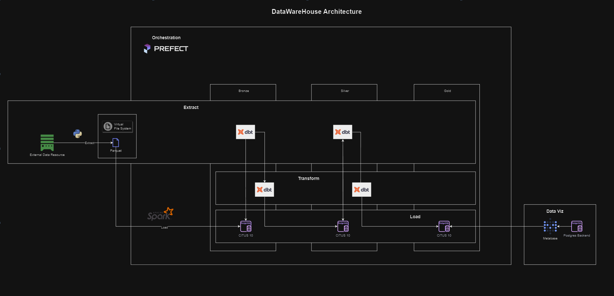

# Data Warehouse Project

[](https://www.getdbt.com/)
[](https://www.metabase.com/)

This repository contains a comprehensive data warehousing project that integrates various technologies and tools to build a powerful and scalable data warehouse solution. With Docker Compose as the orchestrator, I have combined the capabilities of Citus 10, Metabase, Prefect, dbt, Spark, and Jupyter Notebook to create an amazing data analytics and processing platform.

## Technologies and Tools Used

- Docker Compose: For managing the deployment and orchestration of the entire data warehouse environment.

- Citus 10: A distributed database that scales out PostgreSQL to handle large datasets and complex queries efficiently.

- Metabase: A user-friendly and intuitive BI tool for creating insightful visualizations and dashboards.

- Prefect: An advanced workflow management system for orchestrating data pipelines and ETL processes.

- dbt (data build tool): To transform and model raw data into analytics-ready tables using SQL.

- Apache Spark: A fast and distributed data processing engine, ideal for big data analytics and data transformation.

- Jupyter Notebook: An interactive environment for data exploration, analysis, and sharing.

## Setup and Usage

### Prerequisites

- Docker and Docker Compose installed on your system.

### Installation

1. Clone this repository to your local machine.

```
git clone https://github.com/brenoyano/data_warehouse.git
```

2. Navigate to the project directory.

```
cd data_warehouse
```

3. Start the data warehouse environment using Docker Compose from the .docker folder.

```
docker-compose up -d
```

4. Access the services:

   - Citus 10: [http://localhost:5432](http://localhost:5432)
   - Metabase: [http://localhost:3000](http://localhost:3000)
   - Prefect: [http://localhost:8080](http://localhost:8080)
   - Jupyter Notebook: [http://localhost:8888](http://localhost:8888)

### Data Pipelines and Processing

This data warehouse project provides a structured approach to data processing and analytics. The workflow is as follows:

1. Raw data is ingested into the system and stored in the Citus database.

2. dbt models are used to transform and prepare the data for analysis, creating analytics-ready tables.

3. Prefect orchestrates the data pipelines and ETL processes, ensuring data quality and reliability.

4. Apache Spark is utilized for advanced analytics and processing tasks on large datasets.

### Data Visualization and Reporting

Metabase serves as the frontend for data visualization and reporting. It connects to the Citus database to access the prepared data and offers a user-friendly interface for creating charts, dashboards, and reports. Users can explore and gain insights from the data through Metabase's intuitive UI.

### Advanced Analytics and Data Exploration

Jupyter Notebook provides a flexible and interactive environment for advanced data analytics and exploration. Data scientists and analysts can use Jupyter notebooks to run complex data processing tasks, conduct machine learning experiments, and perform in-depth data analysis.

## Architecture




## Contribute

I welcome contributions to make this data warehouse project even more amazing! Feel free to fork the repository, create a new branch, and submit pull requests for your improvements.
